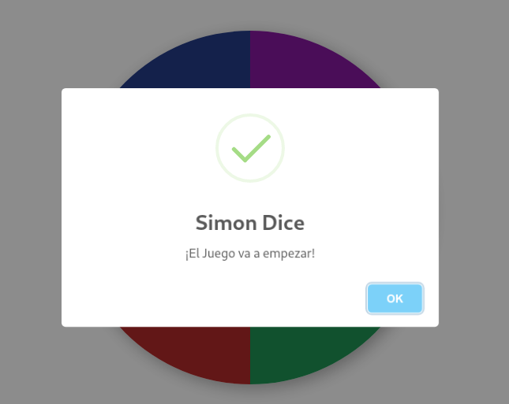

# Simon Dice

Proyecto final del curso de [fundamentos de JavaScript](https://platzi.com/clases/fundamentos-javascript-2018) en [Platzi](https://platzi.com).

Puedes encontrar mi codigó de todo el curso en [UltiRequiem/js-fundamentals-2018](https://github.com/UltiRequiem/js-fundamentals-2018).
